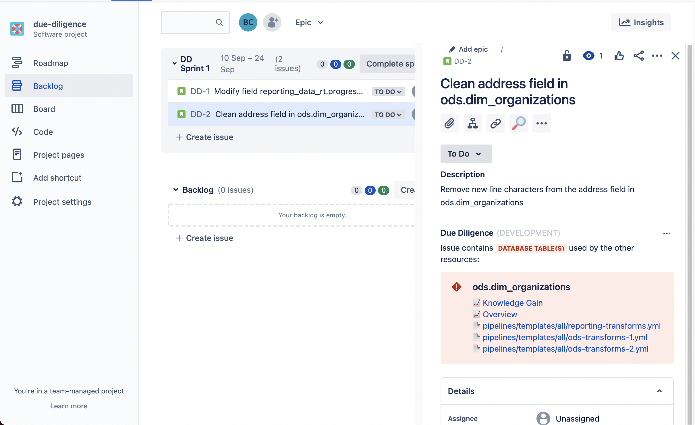
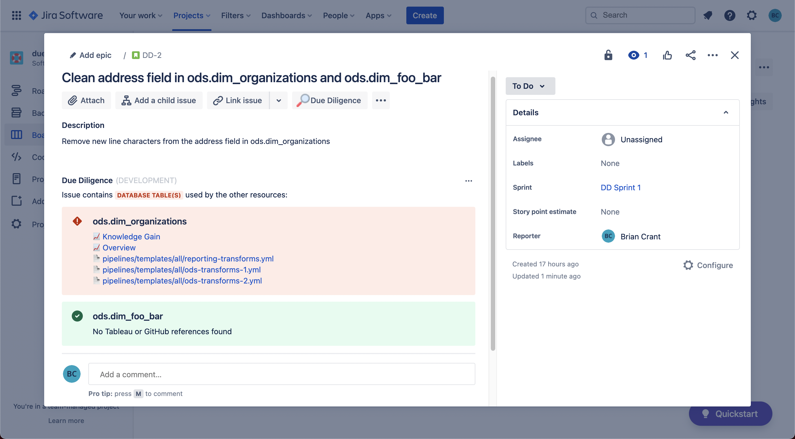

# Diligence Doer
Built for data teams that Do their Diligence.

[comment]: <> (> I am a little teapot. [Watch demo video on YouTube.]&#40;https://www.youtube.com/watch?v=4to2ln6pME8&#41;)

     

----

# Overview
**Diligence Doer** is an [Atlassian Forge](https://developer.atlassian.com/platform/forge/) app for Jira. It works by parsing the summary of a Jira Issue for database tables or columns, then displays the other resources where those database tables or fields are being used. 

Currently, those resources can come from two places: Github and Tableau.

**Github**
- Given a Github Repository and authentication token, Diligence Doer will return the name and link to the file(s) that contain the database table(s) in the summary of the Jira Issue. 
- In the app, these files are marked with the :page_facing_up: emoji.    
  
**Tableau**
- Given a Tableau Server and authentication token, Diligence Doer will return the name and link to the dashboard(s) whose datasources contain the database table(s) or field(s) in the summary of the Jira Issue. 
- In the app, these dashboards are marked with the :chart_with_upwards_trend: emoji.


----


# Usage

> The information displayed by Diligence Doer can be seen directly in a Jira Issue underneath the description...


> and in other places an Issue may exist, like the Backlog...



> If the database table referenced in the ticket _is not_ referenced in any other resources, Diligence Doer lets you know that, too!




----


# Getting Started
### View [SETUP.md](documentation/SETUP.md) documentation for an in depth walk through of the cloud deployment.

This project was built for the Atlassian Codegeist Hackathon 2021. If you would like to learn more about building apps with Atlassian Forge, here are some notes I took that will help you get started!

### Atlassian Forge
- Make account or log in
- Visit Atlassian Website
  - [Getting Started with Forge](https://developer.atlassian.com/platform/forge/getting-started/)
- Download Docker
  - Visit [Docker's website](https://hub.docker.com/editions/community/docker-ce-desktop-mac/) 
    and download the Docker.dmg
  - Install & Run Docker.dmg
  - Make sure the Docker whale is running in the system bar
- [Install Forge on MacOS](https://developer.atlassian.com/platform/forge/installing-forge-on-macos/)
  - `$ nvm install --lts=Erbium`
  - `$ nvm use --lts=Erbium`
- [Install the Forge CLI](https://developer.atlassian.com/platform/forge/getting-started/#install-the-forge-cli)
  - `$ npm install -g @forge/cli`
- [Hello World App in Jira](https://developer.atlassian.com/platform/forge/build-a-hello-world-app-in-jira/)
  - Here is a [quick video](documentation/images/Forge_Jira_HelloWorld.mp4) I took after getting the Hello World app up and running.
  - Here are some of the commands you will use after installing the CLI
    - `$ forge login`
    - `$ forge create`
    - `$ forge deploy`
    - `$ forge install`
    - `$ forge tunnel`


----


# Use Case Specific Caveats
Action may be required to customize this tool for your specific use case. In this section I will identify use cases which would require you to make code or configuration changes to this project, and point you towards the appropriate files in this repository to make those changes. 

### Using an Enterprise Github account

You will need to change the url endpoint to access the API for GitHub Enterprise Server. Edit the `authenticate_github()` function in the [authentication.py](backend/lambda/utils/authentication.py) file to point to your Enterprise Account. The change you need to make is in the function's docstring.

### Identifying SQL commands in YML files

Not all data pipelines or orchestrators use YML and certainly not all of those that do use it in the same way. The functionality to look for SQL in YML files will be useful for others that use AWS Datapipeline or [Dataduct]("https://github.com/coursera/dataduct"), but may be noisy feature for those that do not.

If you **DO NOT** have YML files that contain SQL in your repo... 
You can disable this feature by changing the following line in the `get_files_containing_sql()` function of the [get_repository.py](backend/lambda/github/get_repository.py) file.
  - Change from: `if len(split_name) >= 2 and split_name[1] in ['sql', 'yml']:`
  - Change to: `if len(split_name) >= 2 and split_name[1] == 'sql':` 

If you **DO** have YML files that contain SQL in your repo...
- The YML parser is hardcoded to read the keys used by Dataduct. It parses all keys named `steps` that are of `step_type: sql_command`
- If you want to parse your YML files but do not use Dataduct, you may need to adjust the YML keys and their properties to match your YML structure in the [parse_yml.py](backend/lambda/github/parse_yml.py) file. 
 
### Handling environment variables in YML files
The use of environment variables in YML files may introduce breaking characters (`%`, `{{`, `}}`) to the PyYaml parser. Instead of letting these fail silently, which would result in none of the YML file being parsed, we have provided two solutions for this case.

If you **DO NOT** have YML files that contain environment variables pertinent to this project, such as schema, table, or field names, you can opt to exclude this altogether.
- To prevent the parser from finding and replacing environment variables, simply pass an empty string `''` as the `env_var_file_path` in the `parse_yml()` function found in the [parse_yml.py](backend/lambda/github/parse_yml.py) file.
- Alternatively, in the `read_bytestream_to_yml()` function in the same file, you could comment out the line 
```replace_yml_env_vars(linted_yml_file, replace_dict)``` 
and change the input of the `yaml.safe_load()` function to `stream=linted_yml_file`

If you **DO** have YML files that contain environment variables pertinent to this project, such as schema, table, or field names, you can find and replace environment variables with their keys.
- To find and replace environment variables with their keys, provide the path to the specific YML file in repository that contains the environment variables as key value pairs in the function mentioned above.


----


# Project To Do's:
- [ ] Add support for parsing Spark SQL and DataFrames
- [ ] Add support for other code repository hosts (BitBucket, Gitlab) and BI Tools (Looker, Power BI)
- [ ] Add support for matching individual fields 
  - [x] Ingest and parse fields from Github and Tableau
  - [ ] Determine best way to shape the data for this use case
  - [ ] Determine best way to identify a field name separate from database table in a Jira Issue Summary
    - For instance, consider the issue summary: `"Combine address1 and address2 fields in ods.customers"`
    - If we add databases as a source (Snowflake, Redshift, BigQuery), we could then check each word in the summary against the actual schema for the database table:
    ```
    "ods.customers.Combine"
    "ods.customers.address1"
    "ods.customers.and"
    "ods.customers.address2"
    "ods.customers.fields"
    "ods.customers.in"
    ``` 


----


# Contributing  
Pull requests are welcome. For major changes, please open an issue first to discuss what you would like to change.  


# License  
[](https://choosealicense.com/licenses/mit/)  


# Authors 
- Brian Crant &emsp;|&emsp; [LinkedIn](https://www.linkedin.com/in/briancrant/)
- John McDonald &emsp;|&emsp; [LinkedIn](https://www.linkedin.com/in/john-mcdonald-dev/)  

<br><br>
<figure>
    <a href="https://paypal.me/briancrant?locale.x=en_US"> 
        
    </a>
</figure>

<br><br>