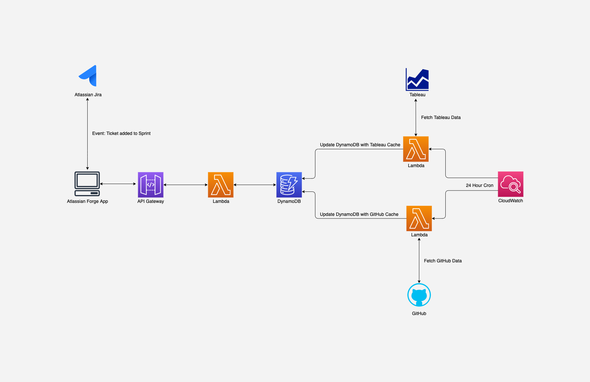

# Diligence Doer Setup Guide
This is a comprehensive setup guide that will
allow you to make changes and redeploy seamlessly, 
enabling you to do things like...
- Redeploy in seconds
- Enable / Disable functionalities
- Contribute to the project and make pull requests!

Following these steps to set up your environment will give you maximum control and flexibility. 

### Introduction
All instructions assume macOS, that you have [Homebrew](https://brew.sh/) and `git` installed, 
and tries not to assume anything else. Let me know if I overlooked anything or 
if you run into any troubles getting set up using these instructions.

### Project Architecture
Before diving into the specifics, let's take a look at the project architecture...  

# Prerequisites
### Third Party Accounts
We will be using a few third party tools, some of which will require admin privileges.

**Infrastructure**
- Amazon Web Services
- Atlassian Forge

**SaaS**
- Jira
- Github
- Tableau Server / Tableau Online

### Are these services free?
This project can run entirely within free tier AWS service quotas. 
Atlassian offers a free trial of their Jira software, however, 
this project is best suited for an enterprise Jira deployment.

### Credentials
Following the steps below will give you access to all the credentials that you will need for this project. 
If you have some of these accounts and are not sure if you have all the credentials, you can view the 
[.env.example](../backend/.env.example) for a full list of the credentials you will need. 

If you are not familiar with environment variables, 
hidden files like `.env` and the Python `dotenv` package, you can visit 
[this document](https://github.com/bcrant/Tableau2Slack/blob/main/documentation/2-virtualenvexample.md#environment-variables) 
for a crash course.

__Create a copy of the [.env.example](../backend/.env.example) and name it `.env`.__

You will be replacing the sample values with your credentials 
and desired variable names as you complete the next steps.

# Third Party Setup & Configuration
### Atlassian developer account steps...
• Make account or log in

### Jira steps...
• Make account or log in

### Tableau steps…
- Make account or log in
- Generate a [Personal Access Token](https://help.tableau.com/current/server/en-us/security_personal_access_tokens.htm)
- Add your Tableau environment variables to `.env`

----

# Development Environment
### 1. Clone Repository
- `$ git clone https://github.com/bcrant/diligence-doer.git`

### 2. Python
Install the Python version manager `pyenv`
- `$ brew install pyenv`
- `$ brew install pyenv-virtualenv`
  
Download the Python version used in this project.
- `$ pyenv install 3.8.10`
- `$ pyvenv local 3.8.10`

Create a virtual environment for this project using that Python version.
- `$ pyenv virtualenv 3.8.10 diligence-doer`
- `$ pip install --upgrade pip`
- `$ pip install -r requirements-cli.txt`

Install the build dependencies to your virtual environment (mainly AWS CLI)
- `$ cd backend && pip install -r ./requirements.txt`

### 3. NodeJS
Install the NodeJS version manager `nvm` from source...
- `$ curl -o- https://raw.githubusercontent.com/nvm-sh/nvm/v0.38.0/install.sh | bash`

Restart your shell so the path changes take effect...
- `$ exec $SHELL`

### 4. AWS CLI
You will then need to install and 
[configure the AWS CLI](https://docs.aws.amazon.com/cli/latest/userguide/cli-configure-quickstart.html) 
with your credentials
- `$ aws configure`

### 5. AWS CDK 
- Make account or log in
- Look at [.env.example](../backend/.env.example) to get a preview of the credentials 
  you will be producing
- The [cdk.json](../backend/cdk.json) file tells the CDK Toolkit how to execute your app.
- Useful commands:
  * `$ npm run build`   compile typescript to js
  * `$ npm run watch`   watch for changes and compile
  * `$ npm run test`    perform the jest unit tests
  * `$ cdk deploy`      deploy this stack to your default AWS account/region
  * `$ cdk diff`        compare deployed stack with current state
  * `$ cdk synth`       emits the synthesized CloudFormation template

### 6. Atlassian Forge
- Make account or log in
- Visit Atlassian Website
  - [Getting Started with Forge](https://developer.atlassian.com/platform/forge/getting-started/)
- Download Docker
  - Visit [Docker's website](https://hub.docker.com/editions/community/docker-ce-desktop-mac/) 
    and download the Docker.dmg
  - Install & Run Docker.dmg
  - Make sure the Docker whale is running in the system bar
- [Install Forge on MacOS](https://developer.atlassian.com/platform/forge/installing-forge-on-macos/)
  - `$ nvm install --lts=Erbium`
  - `$ nvm use --lts=Erbium`
- [Install the Forge CLI](https://developer.atlassian.com/platform/forge/getting-started/#install-the-forge-cli)
  - `$ npm install -g @forge/cli`
- [Hello World App in Jira](https://developer.atlassian.com/platform/forge/build-a-hello-world-app-in-jira/)
  - Here is a [quick video](./images/Forge_Jira_HelloWorld.mp4) I took after getting the Hello World app up and running.
  - Here are some of the commands you will use after installing the CLI
    - `$ forge login`
    - `$ forge create`
    - `$ forge deploy`
    - `$ forge install`
    - `$ forge tunnel`

----

# Deploying the Project
When making changes to the Jira app's [manifest.yml](../frontend/manifest.yml) file, you will need to redeploy and reinstall the app to Jira...  
`$ forge deploy`  
`$ forge install --upgrade`  

When making changes to the UI of the app as it appears in Jira, which would be done in [index.jsx](../frontend/src/index.jsx) file, you only need to redeploy to Jira...  
`$ forge deploy`

When making changes to AWS Lambda functions, such as any changes to the files in the [backend/lambda](../backend/lambda) directory, you will need to redeploy for remote execution...  
`$ cdk deploy --profile {YOUR_AWS_PROFILE}`
  
____

# Troubleshooting
See the `Use Case Specific Caveats` section in the [README.md](../README.md) file for the majority of troubleshooting issues.

Beyond those caveats, make sure that you set your environment variables as outlined here and at that they are available to the AWS Lambda execution environment. 

____
\
I hope this guide was helpful! Shoot me a message if you have any questions or would like to learn more.

Cheers,  
Brian
